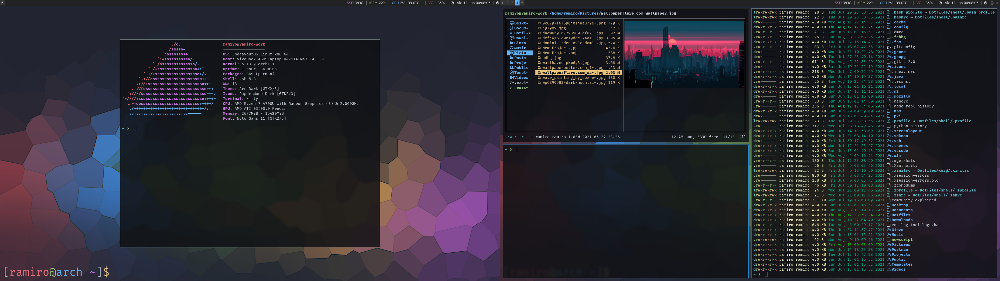

# Dotfiles
These are the config files for the environment that I am currently using in my production machine. I use [stow](https://www.gnu.org/software/stow/) to manage my dotfiles.

- **Distro**: *EndeavorOS* (The setup works well in bare Arch too)
- **Window Manager**: *I3WM*, light tiling window manager
  - *i3-gaps, i3-blocks*



### Installation
To install clone this repository in your home directory and... 
  #### From bare Arch
  And run the script `setup.sh` (git must be installed beforehand). 

  #### From Endeavour or other arch base distro  
  1) Install the packages from the `community` and `aur` package lists. You can run the this command to install the whole list:
  ``
  sudo pacman -S --needed - < community
  ``
  2) Symlink the needed modules from the dotfiles folder with stow.

### Main apps

  - Filemanagers: *Pcmanfm* and *ranger*
  - Images: *feh* and *nitrogen*
  - Editors: *vscode* and *neovim*
  - Browser: *firefox-developers-edition*
  - Terminal: *kitty*
  - Calendar: *calcurse*

### Shell
  - *zsh*
  - Prompt: *starship*
  - Coloring: *lsd*
  - *tree* (stdout folder structure)
  - *bat* Modern substitute for ``cat``
  - *most* Pager, used as substitute for less with coloring

### Development
  - jvm skd manager *sdkman*
  - node version manager *fnm*
  - IDE *Intellij Idea*
  - Rest client *Postman*
  - *Docker*

### Others
  - Backlight control *light*
  - Neovim plugin manger [*vim-plug*](https://github.com/junegunn/vim-plug):
  - Document viewer *Zathura*

### Themes
  - **One Dark**: for terminal, nvim, vscode and IntellijIdea

### Fonts
  - Noto Sans: As global GTK font
  - Fira Code: For Editors, Terminal and IDE

### Backlight fix
1. Install light package
    ```
    sudo pacman -S light
    ```
2. Give admin privilege
    ```
    chmod +s /usr/bin/light
    ```

### Alternate autotiling
From the [Arch Wiki](https://wiki.archlinux.org/title/i3#Automatically_switch_horizontal_/_vertical_window_split_orientation)
1. Install the autotiling AUR package
    ```
    paru -S autotiling
    ```
2. After installation add the following to your `~/.config/i3/config` and reload i3.
    ```
    exec_always --no-startup-id autotiling
    ```

### Git
1. Add shh key
    ```
    ssh-keygen -t rsa -b 4096 -C "name@mail.com"
    ```

### ** TODO **
- Bitwarden dmenu client??
- Arch maintenance functions (orphan packages etc.)
- keybinding for ranger
- keybinding for calcurse
